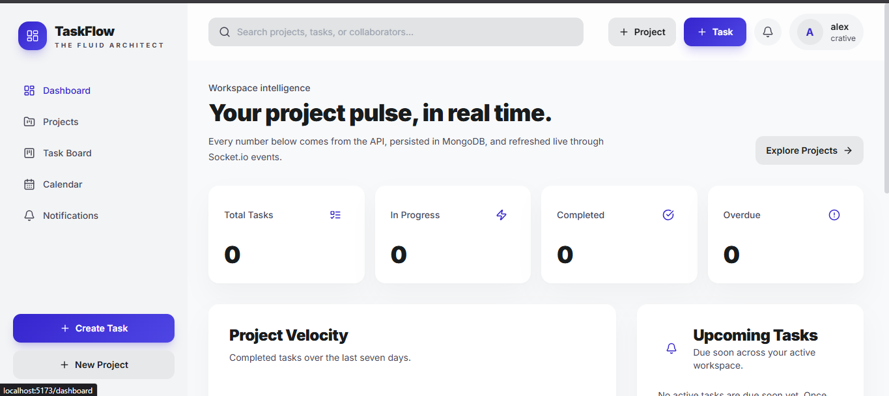
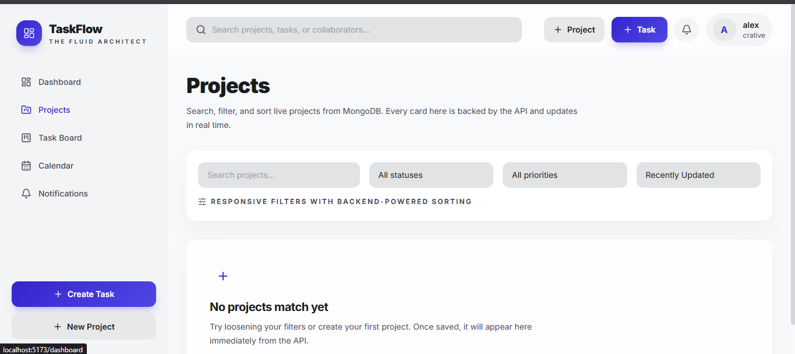
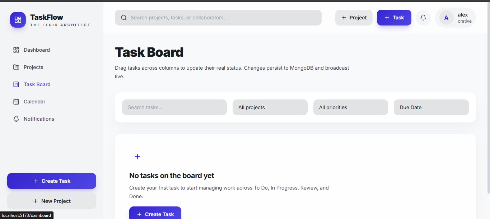

# TaskFlow Architect

A full-stack project management workspace built with:

- React 18
- Redux Toolkit
- React Router v6
- Tailwind CSS
- Node.js + Express
- MongoDB + Mongoose
- JWT authentication
- Socket.io real-time updates

## Structure

```text
project3/
  backend/
    src/
      config/
      controllers/
      middleware/
      models/
      routes/
      services/
      utils/
  frontend/
    src/
      app/
      components/
      features/
      hooks/
      pages/
      services/
      utils/
```

## Run locally

1. Copy `backend/.env.example` to `backend/.env` and set your MongoDB connection string plus `JWT_SECRET`.
2. Copy `frontend/.env.example` to `frontend/.env` if you want to override the default local API URLs.
3. Install dependencies:

```bash
npm install
npm run install:all
```

4. Start both apps:

```bash
npm run dev
```

- Frontend: `http://localhost:5173`
- Backend: `http://localhost:5000`

## Seed demo data

After configuring `backend/.env`, populate MongoDB with a detailed demo workspace:

```bash
npm run seed
```

The seeder resets the app collections and creates users, projects, tasks, subtasks, comments, notifications, and activity history.

Demo login:

```text
ava.patel@taskflow.demo
password123
```


To clear the seeded collections without re-importing demo records:

```bash
npm run seed:destroy
```

## Core features

- Registration and login with JWT auth
- Protected dashboard
- CRUD for projects and tasks
- Real-time task/project/notification updates with Socket.io
- Search, filters, sorting, loading states, and empty states
- Responsive dashboard, projects, task board, task detail, calendar, and notifications


# Output






